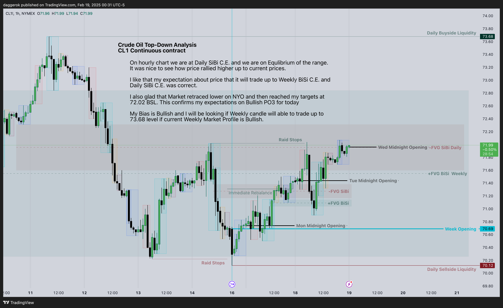
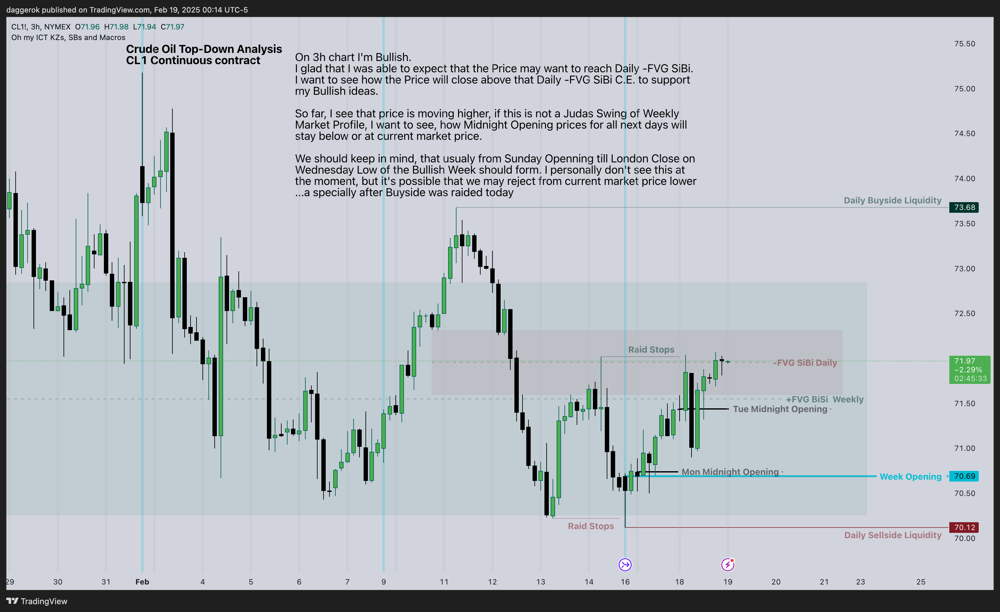
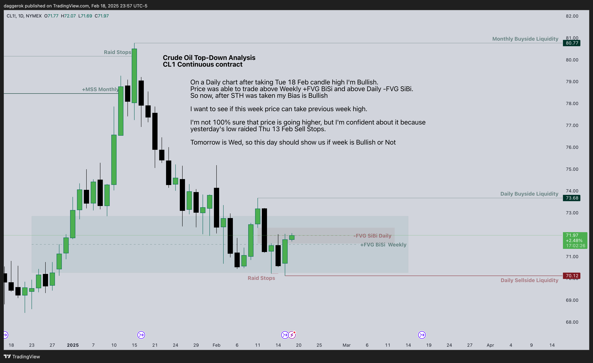
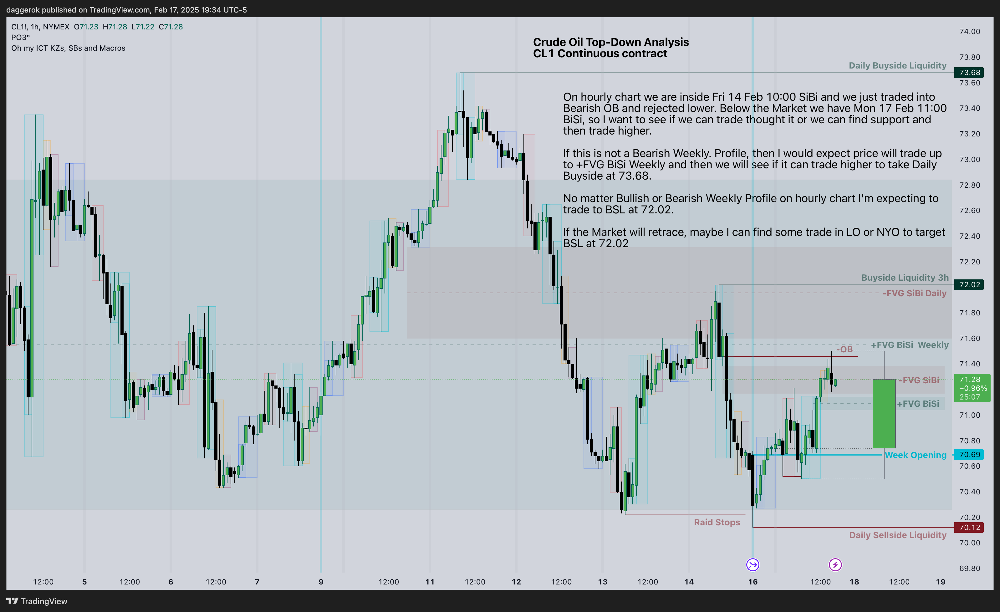
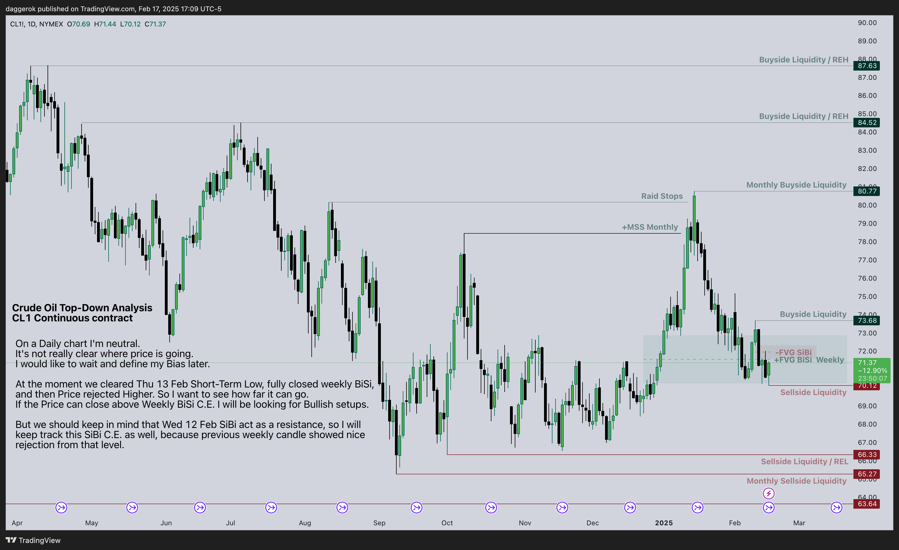
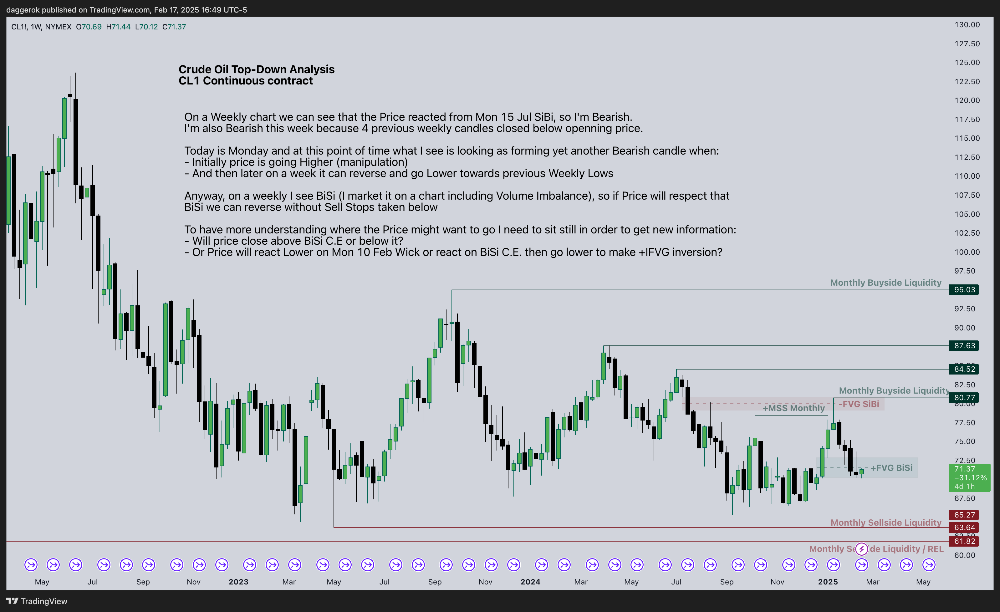

# CL Journal
This is my [Crude Oil journal](https://daggerok.github.io/cl/) in reverse order, based on CL1 continuous contract.
See why and how in [ICT Mentorship 2023 - Proper Learning & The Importance Of Journaling](https://youtu.be/FQqwmDJOtxk)
video.

<!-- nvm install --default 20.9.0 ; bun dev -->

[[toc]]

## 2025 Feb W3
February 2025, Week 3
### 2025-02-18: Tuesday 1h chart analysis

### 2025-02-18: Tuesday 3h chart analysis

### 2025-02-18: Tuesday Daily analysis

### 2025-02-17: Monday 1h chart analysis

### 2025-02-17: Monday 3h chart analysis

### 2025-02-17: Monday Daily chart analysis

### 2025-02-17: Weekly chart analysis

### 2025-02-17: Monthly chart analysis

